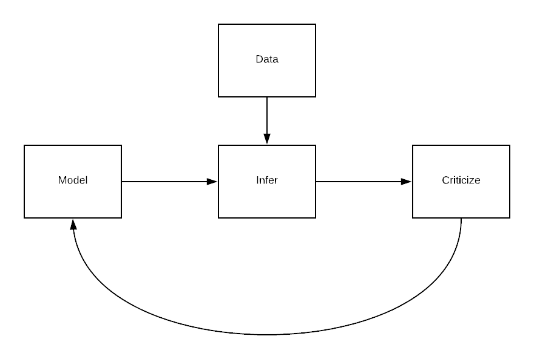

# LendingClub Analysis with Probablistic Programming

# Getting Started

To start, in your project folder run:
```bash
pipenv install --dev
pipenv shell
python -m ipykernel install --user --name=`basename $VIRTUAL_ENV` --display-name "Lending Club"
jupyter notebook
```

If you have issues with any of the commands above, see the `SETUP.md` file for more detailed instructions.

# Utilities

To lint (from within the virtualenv shell):
```bash
pytest --flake8
```

To clear all cache files (from within the virtualenv shell):
```bash
python final-project/utils/utils.py -c
```
or specify specific file types:

```bash
python final-project/utils/utils.py -c hdf pkl
```

# Reproducibility - Data

The dataset that we used for that project is approximately 9 GB, and can be accessed through the Lending Club's website, in the hidden [additional statistics section](https://www.lendingclub.com/company/additional-statistics). For reproducibility, we provide the following:
- In *data*, we store in this repository a subset of the data corresponding to approximately 3,000 loans, with all columns. Therefore, our notebook can be run as is on this subset.
- In *cache*, we store the results of all our inference functions. All of our code checks for cache by default, meaning that by running our notebook you will automatically get results that were obtained on full data.

# Final Project Instructions

The focus of this course is the final project. The goal is for you to choose a real world problem and to loop through the probabilistic modeling cycle using probabilistic programming. You will be expected to write, document, and report your analysis and findings. This will involve a significant amount of programming. Based on the number of students taking the course for credit, you will work either in groups of two or three. I will provide some suggestions; however, you are encouraged to find a problem in a field that excites you.

You will produce an 8-page final report and present your findings to the class in a short presentation at the end of the term. This project will measure your cumulative understanding of the material while providing you with a supportive environment to try out your new skills. Each student within a group will receive an individual grade, corresponding to their involvement in the project. [Source](http://www.proditus.com/syllabus2018.html)

More instructions [here](https://github.com/akucukelbir/probprog-finalproject)

# Box's Loop



# References

Machine Learning: A Probabilistic Perspective, by Kevin P. Murphy, MIT Press, 2012
